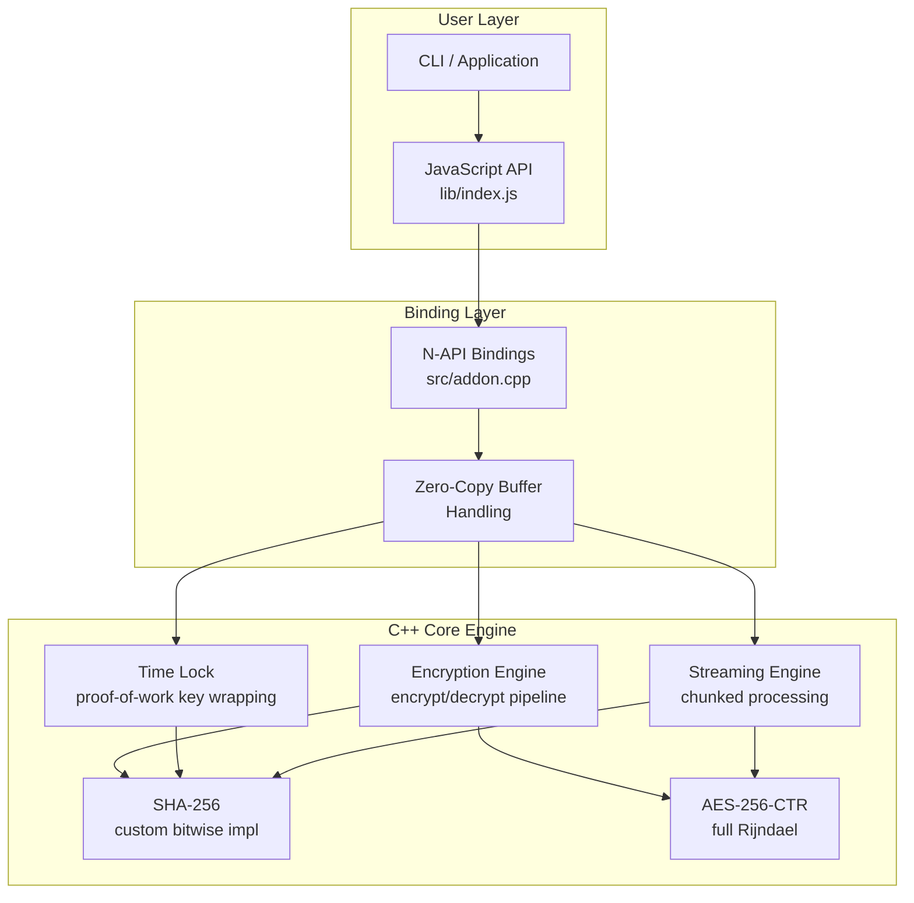
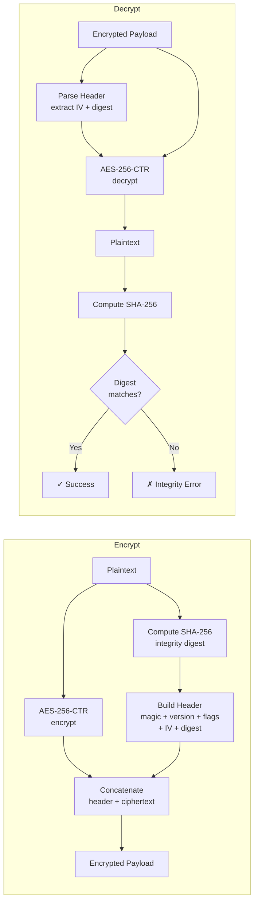
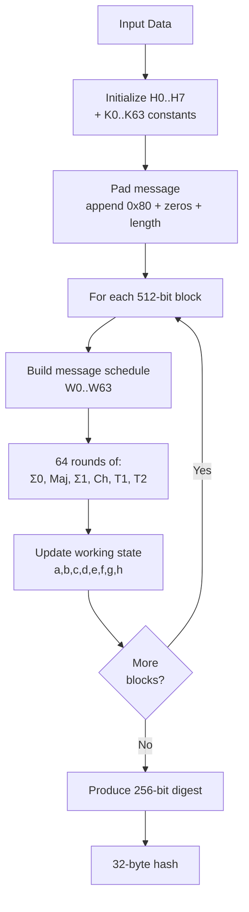
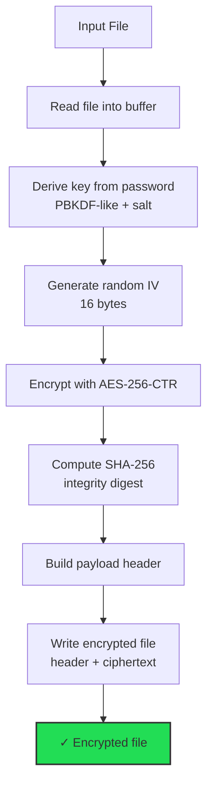

# SecureVault — Educational Cryptography Engine

**High-throughput secure file encryption engine with custom SHA-256, AES-256-CTR, time-locking, and zero-copy N-API bindings.**

[](https://github.com/jituslpl-dev/secure-vault-cryptography-engine/actions/workflows/demo-tests.yml)
[](https://opensource.org/licenses/MIT)
[](https://en.cppreference.com/)
[](https://nodejs.org)

---

## Table of Contents

- [Overview](#overview)
- [Features](#features)
- [Architecture](#architecture)
- [Build Instructions](#build-instructions)
- [Installation](#installation)
- [Usage Examples](#usage-examples)
- [Performance Benchmarks](#performance-benchmarks)
- [Security Considerations](#security-considerations)
- [Roadmap](#roadmap)
- [API Documentation](#api-documentation)
- [Contributing](#contributing)
- [License](#license)

---

## Overview

> **Educational portfolio project — do not use it to protect real secrets.**
> The custom primitives and container format have not received an independent
> security audit. The integrity construction is not authenticated encryption,
> the random generator in the native addon is not cryptographically secure,
> and the timestamp check is enforced by the caller. See
> [PROJECT_STATUS.md](PROJECT_STATUS.md) and [SECURITY.md](SECURITY.md).

SecureVault is an educational cryptographic engine that implements SHA-256 and
AES-256-CTR from scratch in C++. It demonstrates integrity checking,
proof-of-work key wrapping, chunk-based streaming, and N-API bindings.

**Key design principles:**
- **Zero external dependencies** — every cryptographic primitive is implemented from scratch
- **Known-answer tested** — SHA-256 is checked against FIPS 180-4 test vectors; this is not a certification
- **Zero-copy architecture** — N-API buffers are accessed directly without serialization
- **Production tooling** — CMake, clang-format, clang-tidy, cppcheck, ASan/UBSan, CI/CD

---

## Features

| Feature | Description |
|---------|-------------|
| **Custom SHA-256** | Bitwise C++ implementation, 64 rounds, verified against NIST FIPS 180-4 |
| **AES-256-CTR** | Full Rijndael with 14-round key expansion, S-Box, MixColumns, Galois field multiplication |
| **Tamper-evident integrity** | SHA-256 digest embedded in payload; decryption fails if data is modified |
| **Time-lock demonstration** | Proof-of-work key wrapping plus a caller-supplied timestamp check; not a trusted time authority |
| **Chunk-based streaming** | 64KB chunks with rolling SHA-256 hash for large-file processing |
| **Zero-copy N-API** | Direct buffer access between JavaScript and C++ with no serialization overhead |
| **Password-based encryption** | PBKDF-like key derivation from passwords using iterated SHA-256 |
| **Structured logging** | Leveled logger (DEBUG/INFO/WARN/ERROR/FATAL) with timestamps and source location |

---

## Architecture

### System Architecture



### Encryption Pipeline



### Hash Verification Pipeline



### File Processing Workflow



### Payload Format

```
┌─────────────────────────────────────────────────────────────────────┐
│                    Encrypted Payload Layout                         │
├──────────┬──────────┬───────┬────────────┬──────────────┬───────────┤
│ Magic    │ Version  │ Flags │ IV (16B)  │ Digest (32B) │ Ciphertext │
│ "SVENC"  │ 0x01     │ 0x00  │           │ SHA-256(PT)  │ AES-CTR    │
│ 5 bytes  │ 1 byte   │ 1 byte│ 16 bytes  │ 32 bytes     │ N bytes    │
└──────────┴──────────┴───────┴────────────┴──────────────┴───────────┘
                    Header: 55 bytes (HEADER_SIZE)

┌─────────────────────────────────────────────────────────────────────┐
│              Time-Locked Payload (additional section)                │
├──────────┬───────┬──────────────┬──────────────┬────────┬──────────┤
│ Magic    │ Ver   │ Unlock TS    │ Iterations   │ Salt   │ Locked    │
│ "SVTL"   │ Flags │ (8B, BE)     │ (8B, BE)     │ (16B)  │ Key (32B)│
│ 4+2 bytes│       │              │              │        │ XOR-wrapped│
└──────────┴───────┴──────────────┴──────────────┴────────┴──────────┘
              TimeLock Header: 40 bytes + 32 bytes locked key
```

---

## Build Instructions

### Prerequisites

| Requirement | Version | Purpose |
|-------------|---------|---------|
| C++ Compiler | GCC 7+, Clang 6+, or MSVC 2019+ | C++14 support |
| CMake | 3.16+ | Build system |
| Node.js | 18+ | N-API addon (optional) |
| Python | 3.x | node-gyp + demo scripts |

### Option 1: CMake (C++ Library + Tests + Benchmarks)

```bash
# Clone
git clone https://github.com/jituslpl-dev/secure-vault-cryptography-engine.git
cd secure-vault

# Configure
cmake -B build -DCMAKE_BUILD_TYPE=Release \
      -DSECUREVAULT_BUILD_TESTS=ON \
      -DSECUREVAULT_BUILD_BENCHMARKS=ON

# Build
cmake --build build -j

# Run tests
ctest --test-dir build --output-on-failure

# Run benchmarks
./build/securevault_bench
```

### Option 2: CMake with Sanitizers

```bash
# AddressSanitizer (memory leak detection)
cmake -B build-asan -DSECUREVAULT_ENABLE_ASAN=ON -DSECUREVAULT_BUILD_TESTS=ON
cmake --build build-asan -j
ctest --test-dir build-asan --output-on-failure

# UndefinedBehaviorSanitizer
cmake -B build-ubsan -DSECUREVAULT_ENABLE_UBSAN=ON -DSECUREVAULT_BUILD_TESTS=ON
cmake --build build-ubsan -j
ctest --test-dir build-ubsan --output-on-failure
```

### Option 3: Node.js N-API Addon (node-gyp)

```bash
# Install + build native addon
npm install

# Rebuild after C++ changes
npm run rebuild

# Run Node.js tests
npm test
```

### Option 4: Fuzz Testing (requires Clang)

```bash
cmake -B build-fuzz -DSECUREVAULT_BUILD_FUZZER=ON -DCMAKE_CXX_COMPILER=clang++
cmake --build build-fuzz -j

# Run fuzzer for 60 seconds
./build-fuzz/securevault_fuzz -max_len=4096 -max_total_time=60
```

---

## Installation

### As a Node.js Module

```bash
npm install secure-vault
```

```javascript
const secureVault = require('secure-vault');
```

### As a C++ Library (System Install)

```bash
# Build and install
cmake -B build -DCMAKE_BUILD_TYPE=Release
cmake --build build -j
sudo cmake --install build

# Use in your CMake project
find_package(securevault REQUIRED)
target_link_libraries(myapp PRIVATE securevault_core)
```

---

## Usage Examples

### JavaScript API

```javascript
const secureVault = require('secure-vault');

// ─── Basic Encryption ─────────────────────────────────
const plaintext = Buffer.from('Secret data', 'utf8');
const key = secureVault.randomBytes(32);
const iv = secureVault.randomBytes(16);

const encrypted = secureVault.encrypt(plaintext, key, iv);
const decrypted = secureVault.decrypt(encrypted, key);
console.log(decrypted.toString('utf8')); // "Secret data"

// ─── Password-Based Encryption ────────────────────────
const { encrypted, salt } = secureVault.encryptWithPassword(
  Buffer.from('File contents'),
  'myStrongPassword123'
);

const decrypted = secureVault.decryptWithPassword(encrypted, 'myStrongPassword123', salt);

// ─── Time-Locked Encryption ───────────────────────────
const unlockTime = Math.floor(Date.now() / 1000) + 3600; // 1 hour
const iterations = secureVault.estimateIterations(60);   // 60s PoW

const locked = secureVault.encryptWithTimeLock(
  plaintext, key, iv, unlockTime, iterations, salt
);

// Cannot decrypt before unlock time
const future = Math.floor(Date.now() / 1000) + 7200;
const unlocked = secureVault.decryptTimeLocked(locked, future);

// ─── Streaming (Large Files) ──────────────────────────
const { data, digest } = secureVault.streamEncrypt(largeBuffer, key, iv);
const { data: decrypted, verified } = secureVault.streamDecrypt(data, key, iv, digest);

// ─── SHA-256 Hashing ──────────────────────────────────
const hash = secureVault.sha256(Buffer.from('abc'));
// ba7816bf8f01cfea414140de5dae2223b00361a396177a9cb410ff61f20015ad
```

### C++ API

```cpp
#include "encryption_engine.h"
#include "sha256.h"

using namespace securevault;

// ─── Encrypt/Decrypt ──────────────────────────────────
uint8_t key[32] = { /* ... */ };
uint8_t iv[16]  = { /* ... */ };

uint8_t out[plaintextLen + EncryptionEngine::HEADER_SIZE];
size_t outLen;
EncryptionEngine::encrypt(plaintext, ptLen, key, iv, out, outLen);

uint8_t decrypted[ptLen];
size_t decLen;
int result = EncryptionEngine::decrypt(out, outLen, key, decrypted, decLen);
// result == 0 on success, -4 on integrity failure

// ─── SHA-256 ──────────────────────────────────────────
uint8_t digest[32];
SHA256::hash(data, dataLen, digest);
```

### Running the Demo

```bash
# Python demo (no build required)
python test/demo_python.py

# Node.js demo (after npm install)
node examples/example.js

# C++ benchmarks (after cmake build)
./build/securevault_bench
```

---

## Performance Benchmark Harness

The repository includes a native benchmark harness, but it does not publish
unverified headline numbers. Results depend on the compiler, optimization
flags, CPU, input size, and thermal state. Build and run it on the machine you
want to discuss, preserve the raw output, and record that environment alongside
any measurements:

```bash
# C++ benchmarks
cmake -B build -DSECUREVAULT_BUILD_BENCHMARKS=ON && cmake --build build -j
./build/securevault_bench

# Automated benchmark suite (Linux/macOS)
./scripts/run_benchmarks.sh
```

---

## Security Considerations

> **This is an educational portfolio project.** Its hash implementation passes
> included known-answer vectors, but the overall design has not undergone a
> formal security audit or certification. Do not use it to protect real
> sensitive data. Review [PROJECT_STATUS.md](PROJECT_STATUS.md) and
> [SECURITY.md](SECURITY.md).

### Security Properties

- **Confidentiality experiment**: AES-256-CTR is implemented for study, subject to the limitations below
- **Accidental-corruption detection**: the plaintext digest catches changes in normal operation
- **Wrong-key signal**: most incorrect keys fail the digest comparison
- **Time-gate experiment**: the API checks a caller-supplied timestamp and performs configurable proof-of-work

### Known Limitations

1. **PRNG**: Uses XOR-shift (not CSPRNG). Replace with OS CSPRNG for production.
2. **KDF**: Custom PBKDF-like derivation. Consider Argon2id for production.
3. **No AEAD**: CTR mode + separate digest is not authenticated encryption. Consider AES-GCM.
4. **No side-channel hardening**: Not constant-time. Not safe for side-channel environments.

See [SECURITY.md](SECURITY.md) for the full security policy and hardening roadmap.

---

## Roadmap

- [ ] Replace XOR-shift PRNG with OS CSPRNG (`/dev/urandom`, `BCryptGenRandom`)
- [ ] Add AES-GCM authenticated encryption mode
- [ ] Implement Argon2id key derivation
- [ ] Add constant-time comparison for integrity checks
- [ ] Add secure memory zeroization (`explicit_bzero`)
- [ ] Add key rotation and key wrapping (RFC 3394)
- [ ] Add file-based CLI tool with progress bars
- [ ] Formal security audit
- [ ] WASM compilation target
- [ ] Python C-extension bindings

---

## API Documentation

### C++ API

Full Doxygen documentation can be generated:

```bash
doxygen Doxyfile
# Open docs/html/index.html
```

Key classes:

| Class | File | Description |
|-------|------|-------------|
| `SHA256` | `src/sha256.h` | Custom SHA-256 hash function |
| `AES256` | `src/aes256.h` | AES-256 in CTR mode |
| `EncryptionEngine` | `src/encryption_engine.h` | Encrypt/decrypt pipeline with integrity |
| `TimeLock` | `src/time_lock.h` | Proof-of-work time-locking |
| `StreamingEngine` | `src/streaming_engine.h` | Chunk-based streaming encryption |
| `Logger` | `src/logger.h` | Structured logging facility |

### JavaScript API

| Function | Description |
|----------|-------------|
| `sha256(data)` | Compute SHA-256 hash |
| `deriveKey(password, salt, iterations)` | Derive 32-byte key from password |
| `encrypt(plaintext, key, iv)` | Encrypt with AES-256-CTR |
| `decrypt(ciphertext, key)` | Decrypt and verify integrity |
| `encryptWithTimeLock(...)` | Encrypt with time-lock |
| `decryptTimeLocked(ciphertext, timestamp)` | Decrypt time-locked data |
| `isTimeLocked(data)` | Check if data is time-locked |
| `getUnlockTimestamp(data)` | Get unlock timestamp |
| `estimateIterations(seconds)` | Estimate PoW iterations for duration |
| `streamEncrypt(plaintext, key, iv)` | Chunk-based streaming encrypt |
| `streamDecrypt(ciphertext, key, iv, digest)` | Chunk-based streaming decrypt |
| `randomBytes(length)` | Generate random bytes |
| `encryptWithPassword(data, password)` | High-level password encryption |
| `decryptWithPassword(encrypted, password, salt)` | High-level password decryption |

---

## Contributing

See [CONTRIBUTING.md](CONTRIBUTING.md) for development setup, code style, testing requirements, and pull request process.

### Quick Start for Contributors

```bash
# Clone and build
git clone https://github.com/jituslpl-dev/secure-vault-cryptography-engine.git
cd secure-vault
cmake -B build -DSECUREVAULT_BUILD_TESTS=ON && cmake --build build -j

# Run all checks before committing
find src -name '*.cpp' -o -name '*.h' | xargs clang-format --dry-run --Werror
cppcheck --enable=warning,style,performance,portability --error-exitcode=1 src/
ctest --test-dir build --output-on-failure
```

---

## License

MIT License — see [LICENSE](LICENSE) for details.

---

## Acknowledgments

- SHA-256 per [NIST FIPS 180-4](https://nvlpubs.nist.gov/nistpubs/FIPS/NIST.FIPS.180-4.pdf)
- AES per [NIST SP 800-38A](https://nvlpubs.nist.gov/nistpubs/Legacy/SP/nistspecialpublication800-38a.pdf)
- S-Box and Rijndael field operations per [FIPS 197](https://nvlpubs.nist.gov/nistpubs/FIPS/NIST.FIPS.197.pdf)
- N-API per [Node.js N-API documentation](https://nodejs.org/api/n-api.html)

